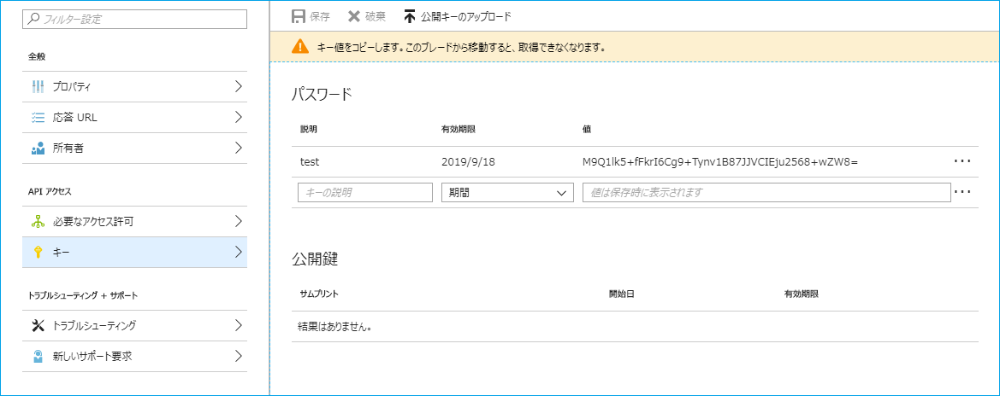

# Get sign-in activity and audit reports with key
Shows how to download sign-in activity log and audit log on Azure AD using key with PowerShell

PowerShell スクリプトで従来のキー (client_secret) を利用して Azure AD のサインイン アクティビティ レポートおよび監査ログを csv 形式で取得する方法を紹介します。

平文のキーによる取得のため、当該スクリプトの運用環境での利用は推奨されません。推奨される方法は証明書を用いたトークン取得です。以下に一連の手順をおまとめしましたので、参考としていただければ幸いです。

## アプリ ID とキーの準備

以下の手順で、Azure AD 上にアプリケーションを準備します。まず、以下のドキュメントに記載された手順に従って、アプリケーションを登録し、"構成設定を収集する" に従ってドメイン名とクライアント ID を取得します。サインインログを一覧で取得するには、Azure AD Premium P1 ライセンス以上も必要です。

Azure AD Reporting API にアクセスするための前提条件  
https://docs.microsoft.com/ja-jp/azure/active-directory/active-directory-reporting-api-prerequisites-azure-portal

以下のような画面でキーが表示されますので、文字列を控えておきます。



続いて、GetSigninAndAuditReportsWithKey.ps1 ファイルを開き、以下の 3 行を確認した結果に合わせて変更します。$client_secret は上記例の値にしていますので、$tenantId と $clientId を適宜変更ください。

```powershell
$tenantId = "yourtenant.onmicrosoft.com" # or GUID "01234567-89AB-CDEF-0123-456789ABCDEF"
$clientId = "FEDCBA98-7654-3210-FEDC-BA9876543210"
$client_secret = "M9Q1lk5+fFkrI6Cg9+Tynv1B87JJVCIEju2568+wZW8="
```

最後に、GetSigninAndAuditReportsWithKey.ps1 を実行します。これによりサインイン アクティビティ レポートと監査ログを csv ファイルとして取得できます。

## 認証処理の内部動作

キーを使用した認証処理では、Azure AD の token エンドポイントに対して client_credentials grant flow でアクセストークンを取得します。

```
POST https://login.microsoftonline.com/yourtenant.onmicrosoft.com/oauth2/token

client_id: FEDCBA98-7654-3210-FEDC-BA9876543210
client_secret: M9Q1lk5+fFkrI6Cg9+Tynv1B87JJVCIEju2568+wZW8=
grant_type: client_credentials
resource: https://graph.microsoft.com
```

取得したトークンを Authorization ヘッダーに Bearer トークンとして添えることで Graph API へアクセスしています。

```
GET https://graph.microsoft.com/beta/auditLogs/signIns HTTP/1.1
Authorization: Bearer eyJ0eXAiOi{省略}3lISmxZIn0.eyJhdWQiOi{省略}joiMS4wIn0.FDlzA1xpic{省略}Nj_6yECdIw

GET https://graph.microsoft.com/beta/auditLogs/directoryAudits HTTP/1.1
Authorization: Bearer eyJ0eXAiOi{省略}3lISmxZIn0.eyJhdWQiOi{省略}joiMS4wIn0.FDlzA1xpic{省略}Nj_6yECdIw
```